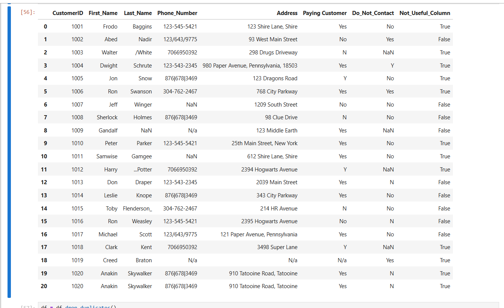
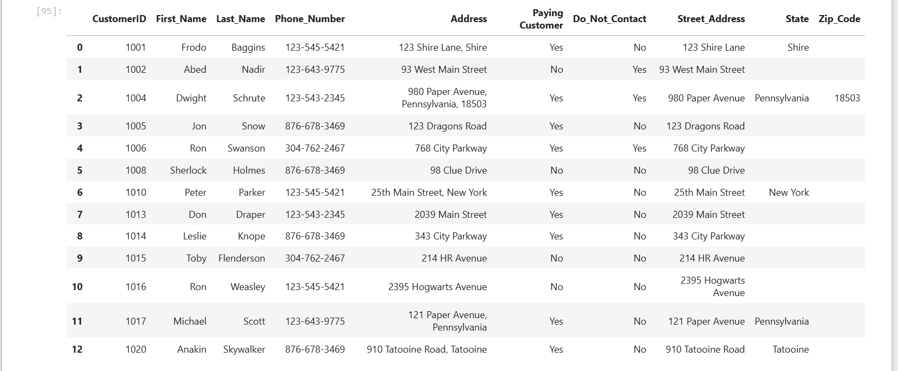

# Customer Call List Data Cleaning

A small Pandas project focused on cleaning a customer contact dataset.

The original dataset contained duplicate records, inconsistent phone number formats, placeholder missing values (`nan`, `<NA>`, `N/a`), and address information stored in a single column.

The cleaning process included:

* Removing duplicate records
* Standardizing customer names
* Cleaning and formatting phone numbers
* Converting placeholder values into proper missing values
* Splitting address data into street, state, and zip code fields
* Standardizing Yes/No values
* Filtering customers marked as "Do Not Contact"

### Techniques Used

* Pandas string methods (`str.replace`, `str.split`, `str.strip`)
* Missing value handling (`replace`, `fillna`, `dropna`)
* Boolean mapping with dictionaries
* Regular expressions (Regex)
* Data filtering and indexing

## Before Cleaning

## After Cleaning

Files
customer_call_list_cleaning.ipynb — notebook containing the cleaning workflow
Customer Call List.xlsx — source dataset
Before_cleaning.png — raw dataset preview
After_cleaning.png — cleaned dataset preview

This project was completed as practice for developing data cleaning and transformation skills using Pandas.
